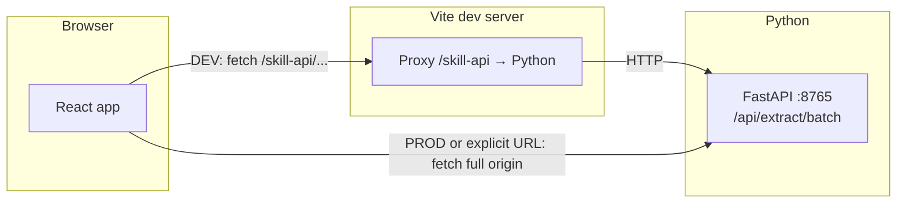

# Backend ↔ Frontend connection (skill extractor)

This document describes how the **React/Vite frontend** talks to the **Python FastAPI skill-extractor** service, what was wired in the repo, and how to run and verify everything locally and in production.

---

## Architecture



| Piece | Role |
|--------|------|
| **`src/services/localNerService.js`** | Calls `POST .../api/extract/batch` with resume/job text; computes local match scores. |
| **`src/services/aiMatchingService.js`** | Batches NER requests for job ranking and candidate ranking. |
| **`server/skill_extractor_server.py`** | Loads `amjad-awad/skill-extractor` via Hugging Face Hub, runs spaCy NER, returns JSON. |
| **`vite.config.js`** | In **development**, proxies `/skill-api` → `http://127.0.0.1:8765` so the browser uses **same-origin** requests. |

---

## How the frontend chooses the API base URL

Logic in `getSkillExtractorBaseUrl()` (`localNerService.js`):

1. **`VITE_SKILL_EXTRACTOR_URL`** (optional in `.env`) — If set (non-empty after trim), the app always uses this value. Trailing slashes are stripped. Use this when:
   - The skill API is on another host/port.
   - You deployed the Python service publicly and build the SPA with that URL.

2. **Vite dev (`npm run dev`)** — If the env var is **not** set, the base URL is **`/skill-api`**. The browser requests e.g. `http://localhost:5173/skill-api/api/extract/batch`; Vite forwards that to `http://127.0.0.1:8765/api/extract/batch`.

3. **Production build (`npm run build`)** — If the env var is **not** set, the client falls back to **`http://127.0.0.1:8765`**. That only works for end users if the API is reachable from **their** machine at that address (usually it is not). For real hosting, **set `VITE_SKILL_EXTRACTOR_URL`** to your deployed API **before** running `npm run build`.

---

## Environment variables

| Variable | Where | Purpose |
|----------|--------|---------|
| **`VITE_SKILL_EXTRACTOR_URL`** | `.env` (frontend) | Full base URL of the skill API (no path). Example: `https://skills-api.example.com` or `http://127.0.0.1:8765`. **Omit or leave empty in local dev** to use the Vite proxy. |
| **`SKILL_EXTRACTOR_PORT`** | Shell when starting **both** skill-server and Vite | Default **8765**. If the port is already in use (Windows: `Errno 10048`), stop the old `python`/`uvicorn` process or set e.g. `8766` for **both** terminals so the proxy still matches. |
| **`VITE_SKILL_EXTRACTOR_PROXY_TARGET`** | Shell when starting Vite | Optional full URL override for the proxy target (replaces `http://127.0.0.1:${SKILL_EXTRACTOR_PORT}`). |
| **`CORS_ORIGINS`** | Python process env | Comma-separated allowed origins for the FastAPI app. Default in code: `*`. Tighten for production (e.g. `https://yourapp.vercel.app`). |
| **`SKILL_EXTRACTOR_MODEL_ID`** | Python process env | Optional override for the Hugging Face model id (default `amjad-awad/skill-extractor`). |

**Security note:** Do not commit real secrets. `.env` is gitignored. This file does not list Firebase or Groq keys.

---

## Local development (verified flow)

### 1. Python dependencies

From the project root:

```bash
cd server
pip install -r requirements.txt
cd ..
```

### 2. Start dev (frontend + skill API together)

```bash
npm run dev
```

This runs **`npm run skill-server`** and **`vite`** in parallel via **`concurrently`** (stopping both if one exits). Wait until the **skill** stream shows **Application startup complete** / **Uvicorn running** (first run may download the Hugging Face model for several minutes). Then open the URL Vite prints (**http://localhost:5173/**).

For **frontend only** (no Python): `npm run dev:vite`. To run the API alone: `npm run skill-server`.

### 3. Quick API checks (optional)

- Health: `GET http://127.0.0.1:8765/health` → `{"ok":true}` when the model is loaded.
- Through Vite only in dev: `GET http://localhost:5173/skill-api/health` → same JSON if the proxy and Python app are up.

---

## Production / static hosting (e.g. Vercel)

1. **Deploy the Python service** somewhere (VM, Cloud Run, Railway, etc.) with HTTPS and a public URL.
2. **Restrict CORS** on FastAPI: set `CORS_ORIGINS` to your SPA origin(s).
3. **Build the frontend** with the API URL baked in:

   ```bash
   set VITE_SKILL_EXTRACTOR_URL=https://your-api.example.com
   npm run build
   ```

   (`export` on Unix.) Vercel: add `VITE_SKILL_EXTRACTOR_URL` in the project environment variables.

4. **`vercel.json`** in this repo only SPA-rewrites to `index.html`; it does **not** proxy to Python. The browser must call the **real** `VITE_SKILL_EXTRACTOR_URL`.

### Example: Render (Python Web Service)

| Setting | Value |
|---------|--------|
| **Root Directory** | `server` |
| **Build Command** | `pip install -r requirements.txt` |
| **Start Command** | `python run_server.py` |

Render sets **`PORT`**; `run_server.py` listens on **`0.0.0.0`** when `PORT` is present. Set **`CORS_ORIGINS`** to your Vercel URL (comma-separated if needed). First deploy may take several minutes while the Hugging Face model downloads — use a plan with enough RAM for spaCy + the model.

---

## Troubleshooting

| Symptom | Likely cause | What to do |
|---------|----------------|------------|
| Console: **Skill extractor batch failed**; summary mentions lexical-only / service unavailable | Python not running, wrong port, or model still downloading | Start `npm run skill-server`; wait for startup complete; confirm `http://127.0.0.1:8765/health`. |
| **Errno 10048** / “only one usage of each socket address” on `8765` | Second copy of the skill server (or leftover `python`) already listening | Run **`npm run skill-server` again** from the project root: it runs `scripts/free-skill-port.mjs` first, which stops the old listener on that port (dev convenience). Or close the other terminal / `taskkill` the PID. |
| **502 / ECONNREFUSED** on `/skill-api/...` in dev | Nothing listening on `8765` | Start the skill server; or set `VITE_SKILL_EXTRACTOR_PROXY_TARGET` if it runs elsewhere. |
| CORS errors when using a **full** `VITE_SKILL_EXTRACTOR_URL` | API blocks browser origin | Set `CORS_ORIGINS` on the Python app to include your SPA origin. |
| Production site never gets NER scores | Built without `VITE_SKILL_EXTRACTOR_URL` and users cannot reach `127.0.0.1:8765` | Set `VITE_SKILL_EXTRACTOR_URL` to your deployed API before `npm run build`. |

---

## Files touched for this wiring

- **`vite.config.js`** — `server.proxy` for `/skill-api`.
- **`src/services/localNerService.js`** — `getSkillExtractorBaseUrl()` and `extractSkillModelBatch()`.
- **`server/skill_extractor_server.py`** — FastAPI app, CORS, `/api/extract/batch`, `/health`.

Firebase (Auth + Firestore) remains separate: configured via `VITE_FIREBASE_*` in `.env` and `src/firebase.js`. The skill extractor does **not** replace Firebase; it only enriches matching scores in the browser.
